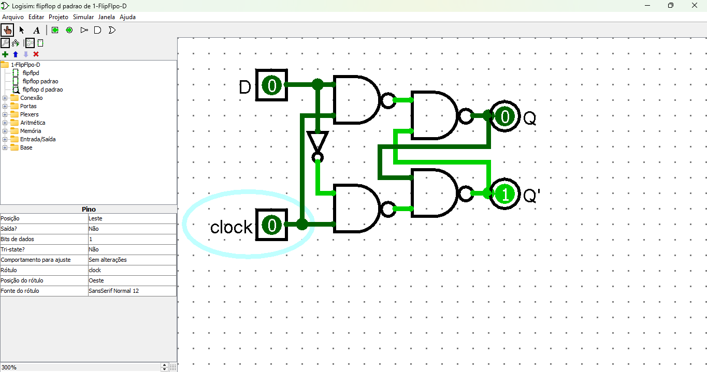
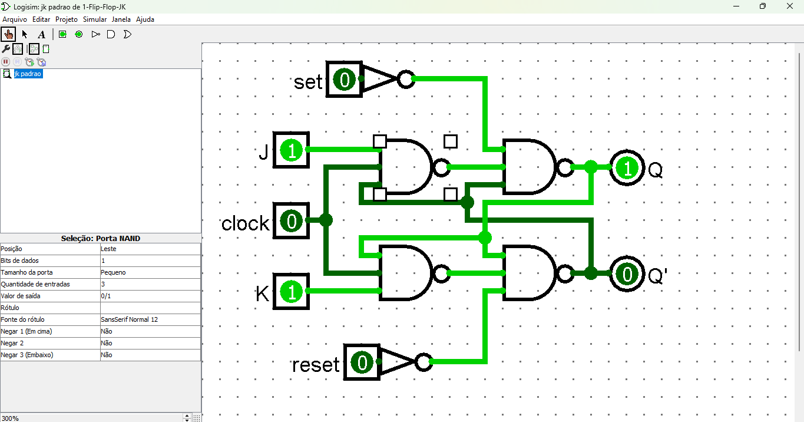
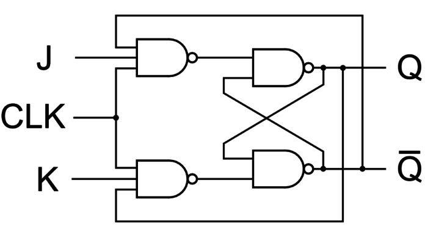

# Flip-Flops: JK, D e T

>**Flip-flops** são circuitos digitais sequenciais usados como elementos de memória, capazes de armazenar um bit de informação. Cada tipo de flip-flop tem características específicas, determinadas por sua tabela verdade e comportamento.

## Flip-Flop D (Data)
>O flip-flop D (ou de "Data" ou "Delay") é um dos flip-flops mais simples e amplamente usados. Ele possui uma única entrada além do **Clock (CLK)**. O valor da entrada D é transferido para a saída Q na borda do clock.

[Link do circuito Flip-Flop D](./1-FlipFlpo-D.circ)

### Características:
- **Entradas**: D, CLK
- **Saídas**: Q, Q̅
- **Tabela Verdade**:
  | D | Q (próximo estado) |
  |---|---------------------|
  | 0 | 0                   |
  | 1 | 1                   |

### Função:
- Na borda de subida (ou descida) do clock, o valor presente em D é armazenado na saída Q.

---

## Flip-Flop JK
>O flip-flop JK é uma versão aprimorada do flip-flop SR, resolvendo a condição indesejada de entrada proibida (S=1, R=1). Ele possui duas entradas: **J** e **K**, além do clock.

OBS: Na imagens anterior vemos o FlipFlop JK com Set Reset, isso é deviso a um erro de estado no Logisim, onde o a primeira porta NAND tem como entrada a saída Q' e o Logisim não consegue interpretrar. Deixarei embaixo o diagrama do FlipFlop JK sem o Set e Reset.

### Características:
- **Entradas**: J, K, CLK
- **Saídas**: Q, Q̅
- **Tabela Verdade**:
  | J | K | Q (próximo estado) |
  |---|---|---------------------|
  | 0 | 0 | Sem mudança         |
  | 0 | 1 | 0                   |
  | 1 | 0 | 1                   |
  | 1 | 1 | Alterna             |

### Função:
- Quando **J=1** e **K=1**, o estado de saída Q alterna (toggle).
- Quando **J=0** e **K=0**, o estado atual permanece o mesmo.

---

## Flip-Flop T (Toggle)
O flip-flop T é derivado do flip-flop JK, com as entradas J e K amarradas juntas. Ele é usado principalmente para dividir a frequência de um sinal.

### Características:
- **Entradas**: T, CLK
- **Saídas**: Q, Q̅
- **Tabela Verdade**:
  | T | Q (próximo estado) |
  |---|---------------------|
  | 0 | Sem mudança         |
  | 1 | Alterna             |

### Função:
- Quando **T=1**, o estado de Q alterna (toggle) na borda do clock.
- Quando **T=0**, o estado de Q permanece o mesmo.

---

## Comparação entre os Flip-Flops

| Tipo   | Entradas      | Aplicação Principal              |
|--------|---------------|-----------------------------------|
| **D**  | D, CLK        | Armazenar dados simples          |
| **JK** | J, K, CLK     | Alternar estados e contadores    |
| **T**  | T, CLK        | Divisão de frequência            |

Os flip-flops são usados como blocos de construção fundamentais em circuitos digitais como registradores, contadores e memórias.

