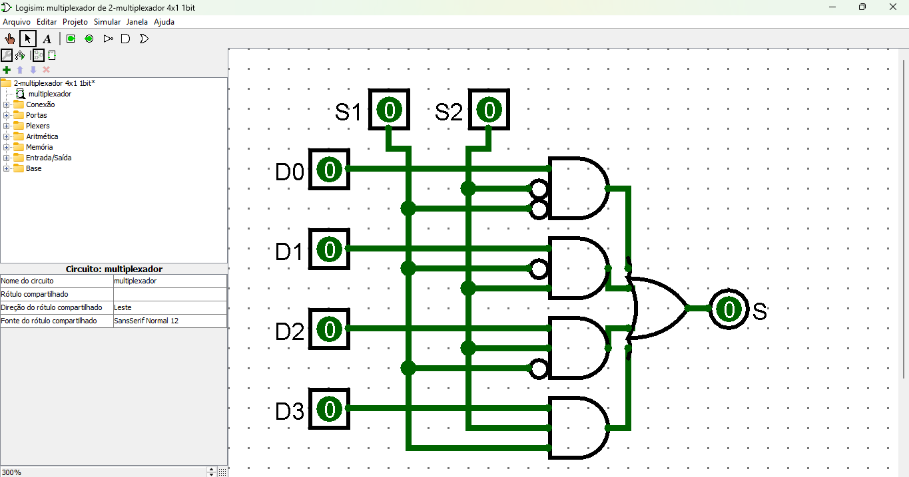

# Multiplexador 4x1 de 1 Bit

Um **multiplexador 4x1** (4 para 1) é um circuito combinacional que seleciona uma dentre quatro entradas de dados e a encaminha para a saída única, com base em dois sinais de controle.

## **Estrutura do Circuito**

O multiplexador 4x1 de 1 bit é composto pelos seguintes componentes:
- **4 entradas de dados**: `D0`, `D1`, `D2` e `D3`.
- **2 sinais de seleção**: `S0` e `S1` (determinando qual entrada será encaminhada à saída).
- **1 saída**: `Y`.
- **Portas lógicas**: AND, OR e NOT para combinar os sinais de entrada, seleção e gerar a saída correta.

### **Tabela Verdade**

| S1 | S0 | Entrada Selecionada | Saída (Y) |
|----|----|---------------------|-----------|
|  0 |  0 | D0                 | D0        |
|  0 |  1 | D1                 | D1        |
|  1 |  0 | D2                 | D2        |
|  1 |  1 | D3                 | D3        |

- Quando `S1 = 0` e `S0 = 0`, a saída será igual a `D0`.
- Quando `S1 = 0` e `S0 = 1`, a saída será igual a `D1`.
- Quando `S1 = 1` e `S0 = 0`, a saída será igual a `D2`.
- Quando `S1 = 1` e `S0 = 1`, a saída será igual a `D3`.

### **Funcionamento**

1. **Sinais de Seleção**: 
   - `S1` e `S0` são usados para determinar qual entrada será passada para a saída.
2. **Portas Lógicas**:
   - Portas **NOT** invertem os sinais de seleção conforme necessário.
   - Portas **AND** combinam as entradas de dados com os sinais de seleção apropriados.
   - Portas **OR** somam os resultados das portas AND para produzir a saída final.

### Diagrama do circuito

[Link do circuito multiplexador](./2-multiplexador%204x1%201bit.circ)
