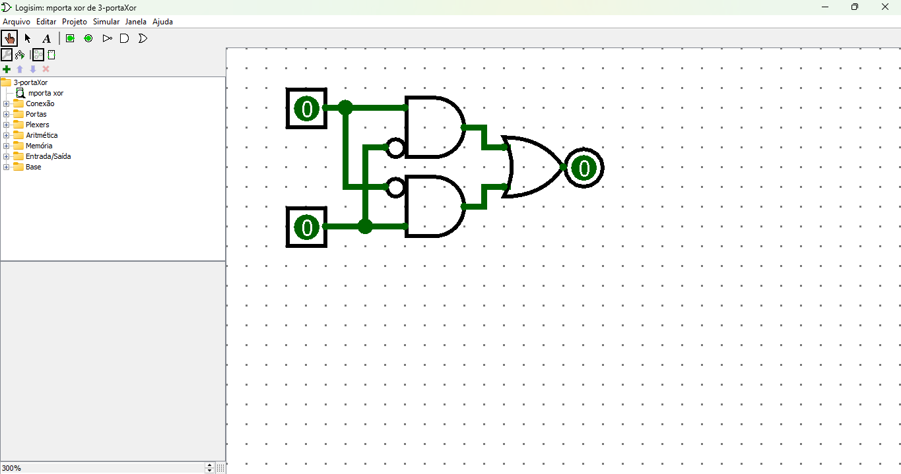

# Circuito Simulador de Porta XOR

Uma porta **XOR** (OU Exclusivo) é um circuito lógico que retorna um valor **1** (verdadeiro) se, e somente se, uma entrada for diferente da outra. Em outras palavras, sua saída será **1** se as entradas forem **diferentes**.

## **Definição Lógica**

A tabela verdade de uma porta XOR é a seguinte:

| Entrada A | Entrada B | Saída (Y) |
|-----------|-----------|-----------|
|     0     |     0     |     0     |
|     0     |     1     |     1     |
|     1     |     0     |     1     |
|     1     |     1     |     0     |

Essa equação combina as entradas usando portas **AND**, **OR** e **NOT**.

## **Circuito Simulador**

### **Componentes Utilizados**
1. **2 Entradas**: `A` e `B`.
2. **Portas Lógicas**:
   - **NOT** (inversor): Para gerar os complementos de `A` e `B`.
   - **AND**: Para criar os produtos parciais.
   - **OR**: Para somar os resultados das portas AND.

---

### **Diagrama Lógico**

[Link do circuito Simulador de porta XOR](./3-portaXor.circ)

## **Passos do Funcionamento**

1. **As entradas `A` e `B` são aplicadas às portas NOT**:
   
2. **As saídas das portas NOT são combinadas com as entradas originais nas portas AND**:
   
3. **As saídas das portas AND são combinadas em uma porta OR**

---

## **Resumo**

- Um circuito simulador de porta XOR pode ser construído com:
  - **Duas portas NOT**, 
  - **Duas portas AND** e 
  - **Uma porta OR**.

- Esse circuito demonstra como o comportamento do OU Exclusivo é alcançado por meio de operações lógicas básicas.

---

## **Aplicações da Porta XOR**

- **Verificação de paridade**.
- **Operações de soma em circuitos aritméticos** (meio somador).
- **Comparadores lógicos**.

