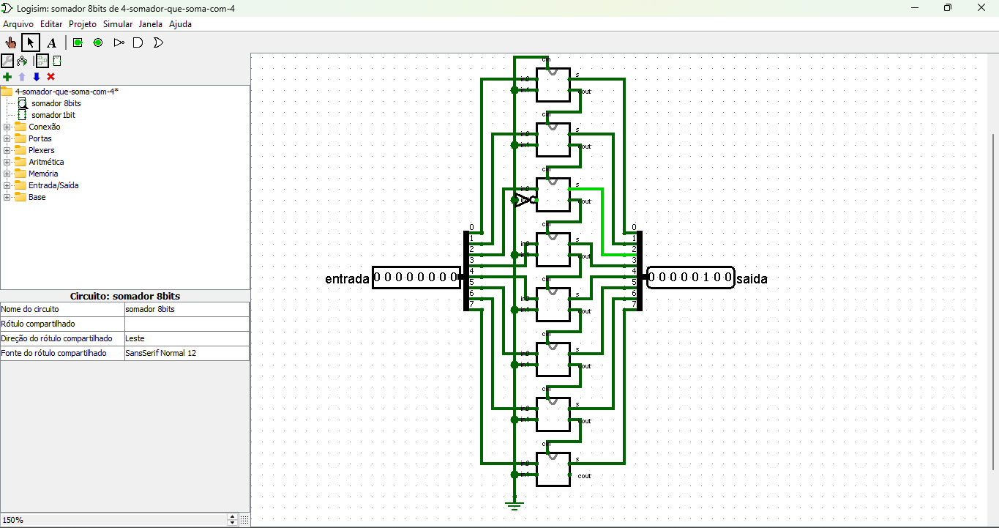
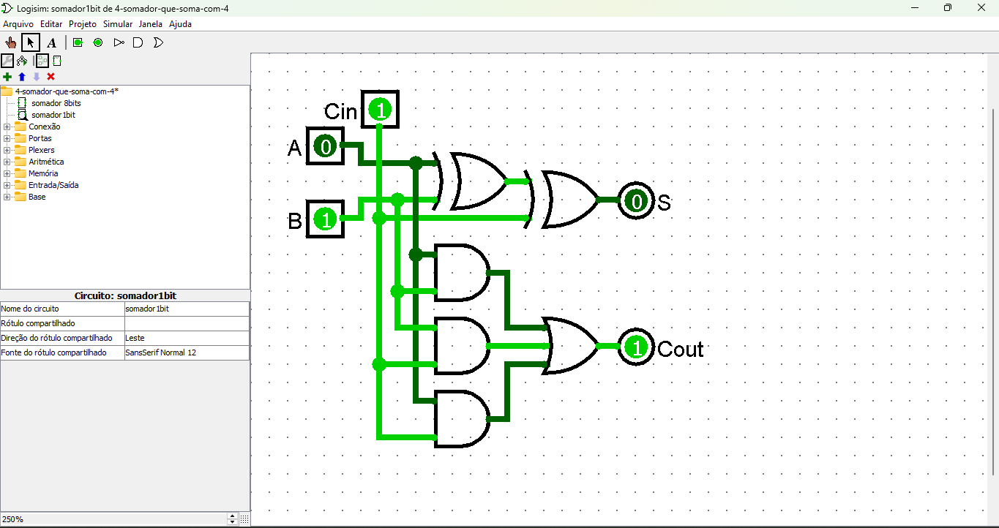

# Circuito Somador de 8 Bits com Constante

Este circuito é um **somador de 8 bits** que realiza a soma entre uma **entrada de 8 bits** e uma **constante fixa**, neste caso, `00000100` (4 em decimal).

[Link do circuito Somador de 8 bits com constante 4](./4-somador-que-soma-com-4.circ)

---

## **Descrição do Circuito**

1. **Entradas**:
   - Uma entrada de 8 bits variável (`A[7:0]`).
   - Uma constante fixa de 8 bits (`B[7:0] = 00000100`).
   obs: a contante fixa é feita atravez do componete terra na parte de baixo do circuito, onde só é negado na entrada 3.

2. **Saída**:
   - Uma saída de 8 bits (`S[7:0]`) que representa a soma entre `A` e a constante `B`.

3. **Componentes Utilizados**:
   - 8 **somadores completos**, dependendo do método de implementação.

   

   - Linhas de **carry** para propagação do bit de transporte entre os bits, onde a saide Cout de um somador é ligado na entrada Cin do proximo somador.

---

## **Tabela Verdade do Somador**

| A (Entrada) | B (Constante) | Saída S | Carry |
|-------------|---------------|---------|-------|
| 00000000    | 00000100      | 00000100 |   0   |
| 00000001    | 00000100      | 00000101 |   0   |
| 00000010    | 00000100      | 00000110 |   0   |
| 11111100    | 00000100      | 00000000 |   1   |
| 11111111    | 00000100      | 00000011 |   1   |

---

## **Funcionamento**

1. **Soma Binária**:
   - O circuito soma cada bit correspondente de `A` e `B`, propagando o bit de transporte (carry) da posição menos significativa (LSB) para a mais significativa (MSB).

2. **Constante Fixa**:
   - Como `B` é constante (`00000100`), a configuração dos bits fixos é feita através do componente terra, que gera o sinal logico baixo ou 0, e é negado na 3 entrada da sinha de somadores.

3. **Carry Propagation**:
   - Caso o resultado da soma em um bit ultrapasse 1, o transporte (carry) é propagado para o próximo bit mais significativo.

