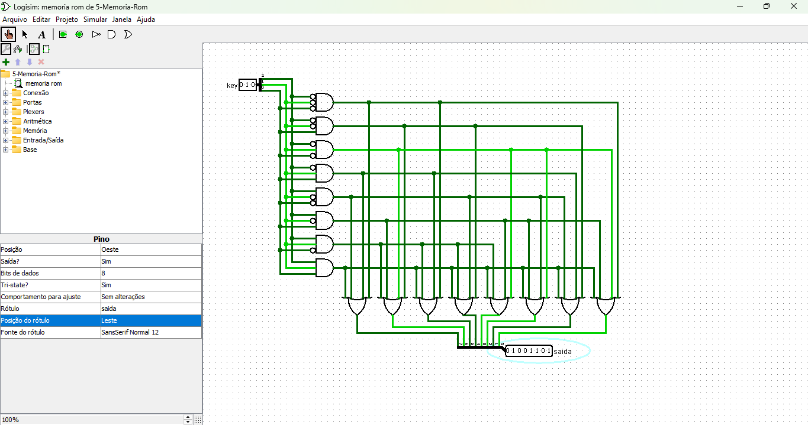

# Memória ROM com Decodificador

Este circuito implementa uma **Memória ROM** (Read-Only Memory), onde os dados armazenados são fixos e não podem ser alterados em tempo de execução. Ele utiliza um **decodificador** para selecionar as células de memória e obter a saída correspondente. A ROM já possui os dados predefinidos, e o decodificador permite acessar uma célula específica com base na entrada fornecida.

[Link do circuito Memória ROM](./5-Memoria-Rom.circ)

---

## **Funcionamento Geral**

1. **Entradas de Controle**:
   - O circuito utiliza um conjunto de bits de **entrada (key)** para selecionar uma célula de memória específica.
   - Cada combinação de bits de entrada ativa uma linha correspondente no decodificador.

2. **Decodificador**:
   - O decodificador traduz a entrada binária (key) em uma única linha de ativação, responsável por acessar a célula de memória correspondente.
   - Por exemplo, para a entrada `010` (3 bits), apenas a terceira linha do decodificador será ativada.

3. **Células de Memória**:
   - Cada célula de memória contém os dados fixos associados à sua posição.
   - Quando uma célula é ativada pelo decodificador, os bits de saída dessa célula são transmitidos para os **ORs de saída**.

4. **Portas OR**:
   - Cada bit de saída da memória é conectado a uma porta OR.
   - As linhas que contêm `1` para uma célula específica ativam as portas OR correspondentes, gerando a saída desejada.

5. **Saída**:
   - O resultado final é uma palavra binária de 8 bits (`saida`) que corresponde aos dados armazenados na célula de memória ativada.

---

## **Funcionamento por Exemplo**

1. **Definição dos Dados**:
   - Cada célula de memória é configurada previamente com os bits de saída desejados.
   - Exemplo:
     - Célula 1: `10011010`
     - Célula 2: `01100101`
     - Célula 3: `11000011`
     - ...

2. **Ativação de uma Célula**:
   - Suponha que a entrada `key` seja `010`:
     - O decodificador ativa a terceira linha.
     - Os valores definidos na terceira célula (`11000011`) são encaminhados às portas OR correspondentes.
     - A saída final será `11000011`.

3. **Comportamento das Portas OR**:
   - As portas OR permitem que cada bit de saída seja acionado somente se a célula correspondente tiver um `1` nessa posição.

---

## **Componentes do Circuito**

1. **Decodificador**:
   - Recebe as entradas binárias (`key`) e ativa uma única linha correspondente.
   - Número de entradas: `n` bits.
   - Número de saídas: \(2^n\) linhas.

2. **Células de Memória**:
   - Cada célula contém uma palavra binária fixa de 8 bits.
   - Essas palavras são configuradas durante o projeto do circuito e não podem ser alteradas.

3. **Portas OR**:
   - Cada bit de saída tem uma porta OR associada.
   - As portas OR recebem os bits de todas as células e geram a saída final com base na célula ativada.

---

## **Vantagens do Circuito**

- **Simplicidade**: A ROM é fácil de implementar, pois os dados são fixos e o decodificador garante o acesso direto às células.
- **Rapidez**: O acesso a uma célula de memória é direto, sem a necessidade de buscas complexas.
- **Confiabilidade**: Como os dados são fixos, a memória é resistente a erros de escrita.

---

## **Aplicações**

- **Armazenamento de dados fixos**:
  - Tabelas de conversão.
  - Valores constantes para sistemas embarcados.
- **Controle de sistemas**:
  - Circuitos que precisam de uma lógica pré-definida, como máquinas de estados.
- **Bootloaders**:
  - A ROM é usada para armazenar instruções de inicialização em sistemas computacionais.

---

## **Resumo**

Este circuito combina um decodificador, células de memória pré-configuradas e portas OR para implementar uma memória ROM funcional. A ativação seletiva das células permite acessar dados fixos de forma rápida e eficiente, tornando-o ideal para aplicações onde os dados não precisam ser alterados dinamicamente.
