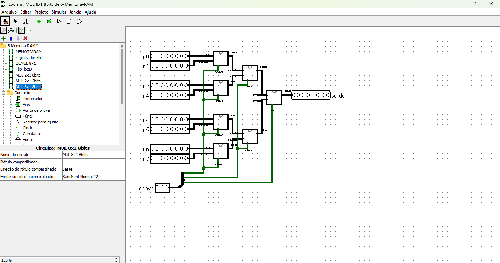

# Memória RAM 
Este circuito implementa uma **Memória RAM** (Random Access Memory) funcional utilizando Flip-Flops D, demultiplexador e multiplexador para leitura e escrita. Ele possui uma interface de 8 bits para entrada e saída de dados e controle por sinais de **clock**, **ler**, **escrever** e uma **chave de endereçamento**.

[Link do circuito Memória RAM](./6-Memoria-RAM.circ)

---

## **Componentes Principais**

1. **Registrador**:
   - As células de memória são implementadas com Flip-Flops D, que armazenam cada bit individualmente.
   - Cada célula é composta por 8 Flip-Flops D, formando um registro de 8 bits.

   

2. **Demultiplexador 1x8 (1 bit)**:
   - Direciona o sinal de escrita para uma das 8 células de memória.
   - A célula de memória ativa é determinada pela **chave de endereçamento**.
   - Permite escrever dados na célula específica apenas se o sinal **escrever** estiver ativado.

   

   obs: nesse caso a saida está sendo de 8 bits para fins de simplificação. Note que no [circuito principal](#memória-ram) a saida do demultiplexador é dicidida através de um Distribuidor, que é nativo do Logisim.

3. **Multiplexador 8x1 (8 bits)**:
   - Seleciona uma das 8 células de memória para leitura.
   - O valor da célula selecionada é determinado pela **chave de endereçamento**.
   - Apenas transfere o valor para a saída se o sinal **ler** estiver ativado.

   **Modo de contrução**: Para fazermos o Multiplexador 8 x 1 de 8 bits primeiro precisamos de um citcuiro de 1 bit.

   

   Depois usando esse circuito faremos um Multiplexador 2x1 de 8 bits.

    

    Logo após, usando o circuito anterior, faremos uma especie de mata mata onde cada bit da minha chave vai para uma linha de multiplexadores 2x1 8bits.

    

4. **Registrador (Cache)**:
   - Um registrador adicional armazena temporariamente os dados lidos antes de enviá-los para a saída.
   - Só atualiza o valor armazenado quando o sinal **ler** está ativado.

5. **Sinais de Controle**:
   - **Clock**: Sincroniza todas as operações do circuito.
   - **Reset**: Reseta os valores armazenados nas células de memória.
   - **Escrever**: Ativa a escrita de dados na célula selecionada.
   - **Ler**: Ativa a leitura de dados da célula selecionada.

---

## **Funcionamento Geral**

### **Escrita de Dados**

1. **Entrada de Dados**:
   - Os dados de 8 bits são aplicados à entrada do circuito.

2. **Sinal de Controle**:
   - O sinal **escrever** deve estar ativado (`1`) para permitir a escrita.

3. **Endereçamento**:
   - A **chave de endereçamento** seleciona a célula de memória onde os dados serão escritos.
   - O demultiplexador utiliza a chave para direcionar o sinal de escrita (`1`) apenas para a célula selecionada.

4. **Armazenamento**:
   - A célula ativada (um conjunto de 8 Flip-Flops D) armazena os dados de entrada no próximo pulso de **clock**.

---

### **Leitura de Dados**

1. **Endereçamento**:
   - A **chave de endereçamento** seleciona a célula de memória cujo valor será lido.

2. **Sinal de Controle**:
   - O sinal **ler** deve estar ativado (`1`) para permitir a leitura.

3. **Seleção pelo Multiplexador**:
   - O multiplexador 8x1 seleciona os 8 bits da célula de memória correspondente ao endereço da chave.

4. **Transferência para o Registrador**:
   - Os dados lidos são transferidos para o registrador temporário (cache).
   - O registrador só atualiza seu valor quando o sinal **ler** está ativado.

5. **Saída**:
   - O valor armazenado no registrador é enviado para a saída de 8 bits.

---

## **Detalhes do Circuito**

1. **Interface de Entrada**:
   - Entrada de 8 bits para os dados a serem escritos.
   - Entrada de 3 bits para a **chave de endereçamento**.

2. **Interface de Controle**:
   - **Clock**: Controla a sincronização do circuito.
   - **Escrever**: Ativa a escrita de dados na célula selecionada.
   - **Ler**: Ativa a leitura de dados da célula selecionada.
   - **Reset**: Reseta os valores armazenados nas células de memória.

3. **Interface de Saída**:
   - Saída de 8 bits, representando os dados lidos da memória.

---

## **Resumo do Fluxo de Operações**

1. **Escrita**:
   - Dados de entrada -> Célula selecionada pelo demultiplexador -> Armazenados no próximo pulso de clock.

2. **Leitura**:
   - Célula selecionada pelo multiplexador -> Registrador -> Envio para a saída.

---

## **Vantagens do Circuito**

- **Armazenamento Dinâmico**:
  - Permite leitura e escrita de dados em tempo real.
  
- **Endereçamento Simples**:
  - Uso de chave de endereçamento para selecionar células.

- **Controle Rigoroso**:
  - Sinais separados de leitura e escrita evitam conflitos.

---

## **Aplicações**

- **Memória Volátil**:
  - Usada em sistemas que exigem leitura e escrita frequentes.
  
- **Sistemas Embarcados**:
  - Implementação de pequenas memórias RAM em dispositivos de baixo custo.

- **Simulação de Memórias**:
  - Ideal para aprendizado de funcionamento de memórias RAM em circuitos digitais.

---

## **Considerações Finais**

Este circuito demonstra como implementar uma memória RAM simples utilizando Flip-Flops D, multiplexadores e demultiplexadores. Ele oferece um modelo prático para entender a dinâmica de leitura e escrita de dados, essencial para sistemas digitais.
