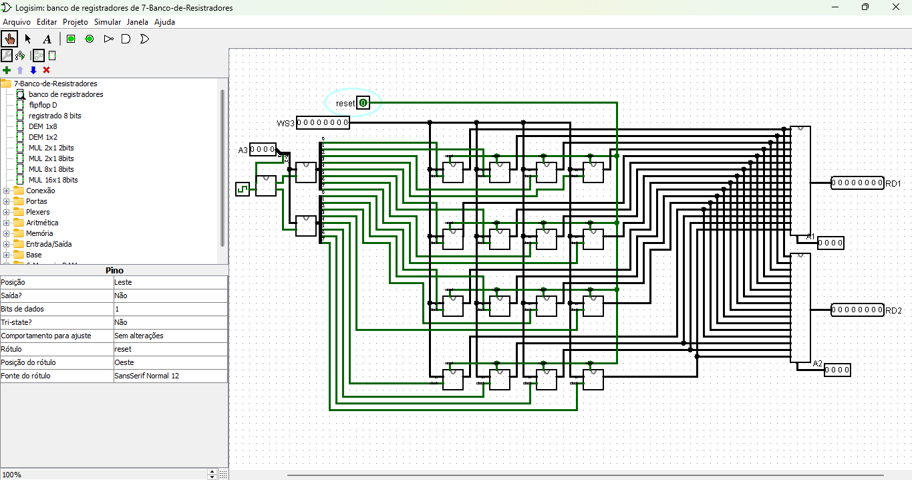

# Banco de Registradores

Este circuito implementa um **banco de registradores**, que é um conjunto organizado de registradores para armazenar e manipular dados em sistemas digitais. Ele utiliza Flip-Flops D, demultiplexadores e multiplexadores para leitura e escrita de dados de forma controlada.

[Link do circuito](./7-Banco-de-Resistradores.circ)

---

## **Componentes Principais**

1. **Registradores**:
   - Cada registrador armazena dados de 8 bits.
   - É implementado com **Flip-Flops D**, sendo cada Flip-Flop responsável por um bit do dado.
   - O banco contém 8 registradores, totalizando 64 bits de armazenamento.

   [Explição do Registrador](../Circuito%2006/README.md)

2. **Demultiplexador (DEM 1x8)**:
   - Direciona o sinal de escrita para o registrador selecionado.
   - O registrador ativo é escolhido com base no endereço fornecido (A3).

   [Explição do Demultiplexador](../Circuito%2006/README.md)

3. **Multiplexadores (MUL 8x1)**:
   - Permitem a leitura simultânea de dois registradores distintos (RD1 e RD2).
   - Cada multiplexador seleciona um registrador com base nos endereços fornecidos (A1 e A2).

   [Explição do Multiplexador](../Circuito%2006/README.md)

4. **Entradas de Controle**:
   - **Clock**: Sincroniza as operações do banco de registradores.
   - **Reset**: Zera os valores armazenados em todos os registradores.
   - **Write Enable (WE)**: Controla se os dados de entrada devem ser escritos no registrador selecionado.

5. **Barramento de Dados (8 bits)**:
   - Usado para transferir dados entre os registradores e o circuito externo.
   - Conecta as entradas e saídas dos registradores.

**obs**: nesse circuito temos 16 registradore, devido a isso, foi feito uma adaptação no demultiplexadores e multiplexadores para que comportagem 16 entradas ou 16 saídas.

---

## **Funcionamento do Circuito**

### **Escrita de Dados**

1. **Seleção do Registrador**:
   - O endereço no sinal A3 seleciona o registrador onde os dados serão escritos.
   - O demultiplexador direciona o sinal de escrita (`1`) apenas para o registrador correspondente.

2. **Habilitação de Escrita**:
   - O sinal **Write Enable (WE)** deve estar ativado (`1`) para permitir a escrita no registrador.

3. **Armazenamento**:
   - No próximo pulso de **clock**, os dados presentes no barramento de entrada são armazenados no registrador selecionado.

---

### **Leitura de Dados**

1. **Seleção dos Registradores**:
   - Os endereços nos sinais A1 e A2 selecionam os registradores cujos valores serão lidos.

2. **Multiplexadores**:
   - Cada multiplexador seleciona o registrador correspondente ao endereço fornecido.
   - O primeiro multiplexador envia os dados do registrador selecionado para a saída RD1.
   - O segundo multiplexador envia os dados do registrador selecionado para a saída RD2.

3. **Transferência de Dados**:
   - Os valores dos registradores selecionados são disponibilizados simultaneamente nas saídas RD1 e RD2.

---

## **Interface do Circuito**

1. **Entradas**:
   - **A3** (3 bits): Seleciona o registrador para escrita.
   - **A1** (3 bits): Seleciona o registrador para leitura em RD1.
   - **A2** (3 bits): Seleciona o registrador para leitura em RD2.
   - **Barramento de Dados** (8 bits): Dados a serem escritos no registrador selecionado.
   - **Clock**: Sincroniza as operações do banco de registradores.
   - **Reset**: Zera todos os registradores.
   - **Write Enable (WE)**: Habilita a escrita no registrador selecionado.

2. **Saídas**:
   - **RD1** (8 bits): Dados do registrador selecionado pelo endereço A1.
   - **RD2** (8 bits): Dados do registrador selecionado pelo endereço A2.

---

## **Resumo do Fluxo de Operações**

1. **Escrita**:
   - Dados de entrada -> Registrador selecionado pelo demultiplexador (A3) -> Armazenados no próximo pulso de clock.

2. **Leitura**:
   - Registrador selecionado por A1 -> Multiplexador -> Saída RD1.
   - Registrador selecionado por A2 -> Multiplexador -> Saída RD2.

---

## **Vantagens do Circuito**

- **Acesso Simultâneo**:
  - Permite a leitura de dois registradores diferentes ao mesmo tempo (RD1 e RD2).
  
- **Endereçamento Eficiente**:
  - Uso de endereços compactos (3 bits) para selecionar registradores.

- **Controle Preciso**:
  - Sinais separados para habilitação de escrita e leitura evitam conflitos.

---

## **Aplicações**

- **Unidades de Processamento**:
  - Utilizado como banco de registradores em CPUs e microcontroladores.

- **Armazenamento Temporário**:
  - Ideal para armazenar dados intermediário
