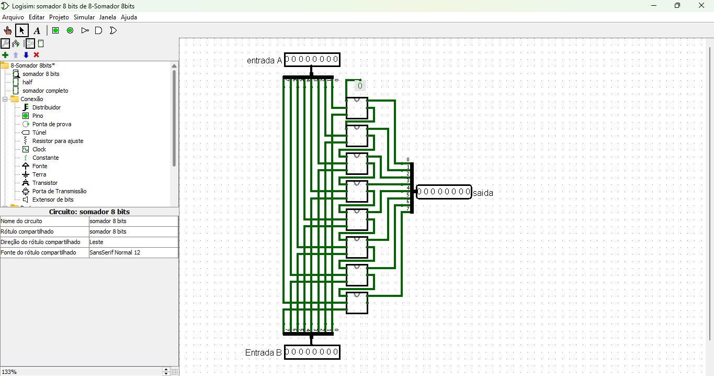
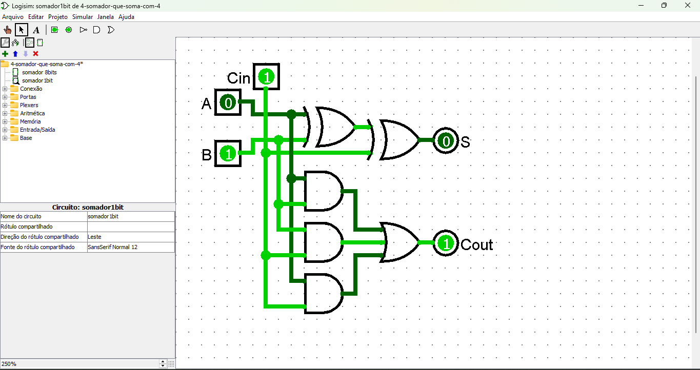

# Somador de 8 Bits com Duas Entradas

Um somador de 8 bits é um circuito digital que realiza a adição binária de dois números de 8 bits. Ele é amplamente utilizado em sistemas computacionais, como unidades aritméticas e lógicas (ALUs), para operações básicas de adição.

[Link do circuito](./8-Somador%208bits.circ)

---

## **Descrição do Circuito**

O circuito é composto pelos seguintes elementos principais:

### **Entradas**
1. **A (8 bits)**:
   - Primeira entrada binária do somador.
   - Representa um número de 8 bits a ser somado.

2. **B (8 bits)**:
   - Segunda entrada binária do somador.
   - Representa outro número de 8 bits.

3. **Carry In (Cin)**:
   - Sinal de transporte (carry) de entrada.
   - Usado para operações de soma que se estendem a partir de um bit menos significativo de uma operação anterior.

---

### **Saídas**
1. **S (8 bits)**:
   - Resultado da soma binária das entradas A e B.
   - Também leva em conta o bit de transporte (Carry In).

2. **Carry Out (Cout)**:
   - Sinal de transporte (carry) de saída.
   - Indica que houve um transporte além do bit mais significativo (overflow).

---

## **Estrutura do Circuito**

O somador de 8 bits é construído com **somadores completos** (Full Adders), cada um responsável por calcular a soma de um único bit.

### **Componentes Principais**
1. **Full Adders**:
   - Um Full Adder soma três bits de entrada: um bit de A, um bit de B e um Carry In.
   - Gera duas saídas: o bit da soma (S) e o Carry Out.

2. **Encadeamento de Carry**:
   - O Carry Out de cada somador é conectado ao Carry In do próximo somador, começando do bit menos significativo (LSB) até o mais significativo (MSB).

---

## **Funcionamento do Circuito**

### **Soma de Bits**
Para cada bit das entradas A e B (do menos significativo ao mais significativo):

1. **Somador do LSB**:
   - O primeiro Full Adder soma os bits menos significativos de A e B (A0 e B0), juntamente com o Carry In inicial (Cin, geralmente 0).
   - Ele gera a soma (S0) e o Carry Out (C1).

2. **Somadores Intermediários**:
   - Cada Full Adder seguinte soma os bits correspondentes de A e B (por exemplo, A1 e B1) junto com o Carry Out do somador anterior.

3. **Somador do MSB**:
   - O último Full Adder soma os bits mais significativos de A e B (A7 e B7) e o Carry Out do somador anterior.
   - O Carry Out final (Cout) é gerado para indicar overflow.

---

## **Tabela Verdade para um Full Adder**

| A | B | Cin | Soma (S) | Carry Out (Cout) |
|---|---|-----|----------|------------------|
| 0 | 0 | 0   | 0        | 0                |
| 0 | 0 | 1   | 1        | 0                |
| 0 | 1 | 0   | 1        | 0                |
| 0 | 1 | 1   | 0        | 1                |
| 1 | 0 | 0   | 1        | 0                |
| 1 | 0 | 1   | 0        | 1                |
| 1 | 1 | 0   | 0        | 1                |
| 1 | 1 | 1   | 1        | 1                |

---

## **Exemplo de Operação**

### Entradas:
- **A**: 11001101 (205 em decimal)
- **B**: 00110111 (55 em decimal)
- **Cin**: 0

### Passo a Passo:
1. Soma bit a bit começando do LSB.
2. Carry é propagado para os bits mais significativos.
3. Resultado final (S) e Carry Out (Cout) são calculados.

### Saída:
- **S**: 10000100 (260 em decimal, considerando apenas os 8 bits menos significativos)
- **Cout**: 1 (indicando overflow).

---

## **Resumo do Fluxo de Operação**

1. **Receber Entradas**:
   - Dois números de 8 bits (A e B).
   - Um Carry In opcional.

2. **Processar Soma**:
   - Utilizar Full Adders encadeados para calcular a soma bit a bit.

3. **Gerar Saídas**:
   - Soma final (S) de 8 bits.
   - Carry Out (Cout) indicando transporte adicional.

---

## **Vantagens do Somador de 8 Bits**

- **Simplicidade**: Baseado em Full Adders, facilmente expansível para somadores de maior largura.
- **Precisão**: Realiza somas binárias com suporte a transporte.
- **Modularidade**: Circuito pode ser integrado em unidades aritméticas maiores.

---

## **Aplicações**

1. **Unidades Aritméticas e Lógicas (ALUs)**:
   - Realiza operações de soma em processadores.
   
2. **Cálculos Aritméticos**:
   - Usado em sistemas digitais para adições simples.

3. **Subtração Binária**:
   - Pode ser adaptado para subtração com o uso de um complemento de dois.

---

Se precisar de um diagrama ou simulação para complementar a explicação, é só avisar!
