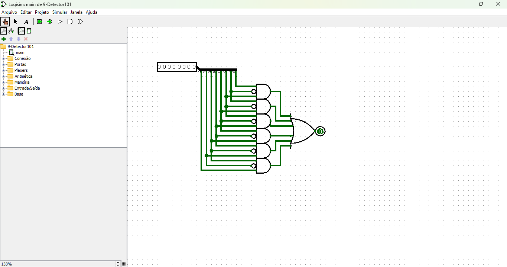

# Detector de Sequência 101

Este circuito é um detector de sequência projetado para identificar o padrão binário `101` em um fluxo de bits de entrada. Ele utiliza portas lógicas básicas para verificar e sinalizar quando essa sequência ocorre.

[Link do circuito](./9-Detector101.circ)

---

## **Descrição Geral**

### **Entradas**
- **Fluxo de bits**: Um conjunto de bits binários é alimentado como entrada no circuito.
- Cada bit é analisado individualmente para verificar a presença da sequência desejada (`101`).

### **Saída**
- Um único bit que será **ativo (1)** quando a sequência `101` for detectada.
- Permanece **inativo (0)** nos demais casos.

---

## **Componentes Utilizados**
1. **Portas Lógicas**:
   - **AND**: Verifica se dois ou mais bits atendem à condição desejada.
   - **NOT**: Inverte o valor de bits, permitindo validar os `0s` na sequência.
   - **OR**: Combina os resultados das portas AND.

2. **Conexões**:
   - Os bits de entrada são conectados a combinações de portas lógicas para validar cada posição da sequência (`1`, `0`, `1`).

---

## **Funcionamento do Circuito**

### **Sequência Detectada**
O circuito busca a sequência `101`, que possui as seguintes condições:
- O **primeiro bit** deve ser `1`.
- O **segundo bit** deve ser `0`.
- O **terceiro bit** deve ser `1`.

### **Processo de Detecção**
1. **Verificação dos Bits**:
   - **Bit 1**:
     - Passa diretamente por uma porta AND para verificar o valor `1`.
   - **Bit 2**:
     - É invertido por uma porta NOT para validar que o bit seja `0`.
   - **Bit 3**:
     - Passa diretamente por outra entrada de uma porta AND para validar o valor `1`.

2. **Combinação Final**:
   - As portas AND combinam os três bits consecutivos (1, 0, 1).
   - Caso as condições sejam atendidas, a saída da porta AND será `1`.
   - O resultado final é enviado para a saída principal.

---

## **Casos de Teste**

| Entrada      | Saída |
|--------------|-------|
| `000`        | `0`   |
| `101`        | `1`   |
| `110`        | `0`   |
| `01010101`   | `1` (para cada ocorrência de `101`) |

---

## **Aplicações do Detector de Sequência**
1. **Comunicação Digital**:
   - Identificação de padrões específicos em fluxos de dados.
2. **Controladores de Estado Finito**:
   - Monitoramento de eventos em sistemas digitais.
3. **Filtros de Sinal**:
   - Extração de informações relevantes de fluxos binários.

---

Se precisar de mais informações sobre a implementação ou quiser expandir o circuito, entre em contato!
