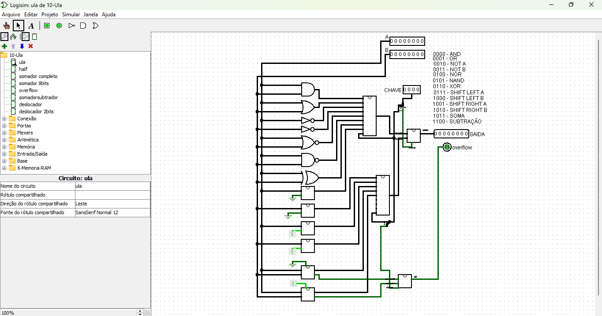
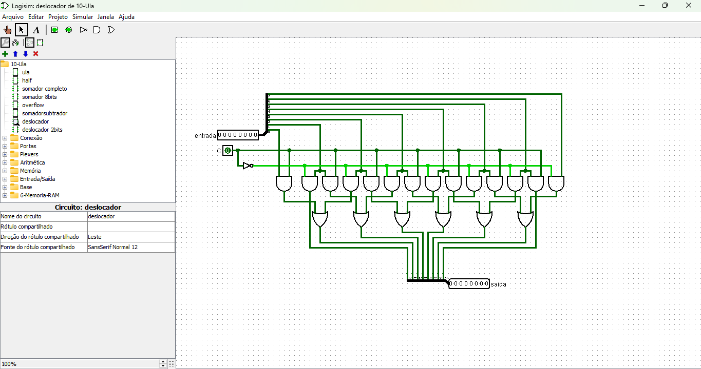

# Unidade Lógica e Aritmética (ULA)

Este é um circuito de **ULA** (Unidade Lógica e Aritmética) implementado no Logisim. A ULA é um dos principais componentes de uma Unidade Central de Processamento (CPU), sendo responsável por realizar operações aritméticas e lógicas.

[Link do circuito](./10-Ula.circ)

---

## **Descrição Geral**

### **Entradas**
- **Entradas A e B**:
  - Dois conjuntos de 8 bits que servem como operandos para as operações.
- **CHAVE (Controle)**:
  - Uma entrada de 4 bits que define qual operação será realizada.

### **Saídas**
- **SAIDA**:
  - Resultado da operação realizada pela ULA, representado em 8 bits.
- **Overflow**:
  - Um bit que indica se ocorreu um **estouro de capacidade** em operações aritméticas (como soma e subtração).

---

## **Componentes do Circuito**

### **Operações Lógicas**
As operações lógicas disponíveis são:
1. **AND**: Realiza a conjunção lógica entre os bits correspondentes de A e B.
2. **OR**: Realiza a disjunção lógica entre os bits correspondentes de A e B.
3. **NOT A**: Inverte todos os bits da entrada A.
4. **NOT B**: Inverte todos os bits da entrada B.
5. **NOR**: Realiza a operação **OR**, seguida por um **NOT**.
6. **NAND**: Realiza a operação **AND**, seguida por um **NOT**.
7. **XOR**: Realiza a operação de disjunção exclusiva entre A e B.

### **Operações Aritméticas**
1. **Soma**:
   - Adiciona os valores binários de A e B.
   - Verifica a ocorrência de **overflow**.
2. **Subtração**:
   - Subtrai o valor de B do valor de A (A - B).
   - Também verifica a ocorrência de **overflow**.

obs: foi usado um mesmo circuito para soma e para subtração, usando um bit como chave.

### **Operações de Deslocamento**
1. **Shift Left A**:
   - Desloca os bits da entrada A para a esquerda, preenchendo com 0.
2. **Shift Left B**:
   - Desloca os bits da entrada B para a esquerda, preenchendo com 0.
3. **Shift Right A**:
   - Desloca os bits da entrada A para a direita, preenchendo com 0.
4. **Shift Right B**:
   - Desloca os bits da entrada B para a direita, preenchendo com 0.

obs: foi usado o este circuito para deslocar os bits, usando uma chave para indentificar o lado do desloque.

---

## **Como Funciona**

1. **Seleção da Operação**:
   - A operação a ser realizada é definida pela entrada **CHAVE**, composta por 4 bits. Cada combinação de bits representa uma operação específica.

   | CHAVE | Operação          |
   |-------|-------------------|
   | 0000  | AND               |
   | 0001  | OR                |
   | 0010  | NOT A             |
   | 0011  | NOT B             |
   | 0100  | NOR               |
   | 0101  | NAND              |
   | 0110  | XOR               |
   | 0111  | Shift Left A      |
   | 1000  | Shift Left B      |
   | 1001  | Shift Right A     |
   | 1010  | Shift Right B     |
   | 1011  | Soma              |
   | 1100  | Subtração         |

2. **Execução da Operação**:
   - Com base no valor da CHAVE, o circuito ativa as portas e componentes correspondentes para realizar a operação.
   - O resultado é direcionado para a saída principal **SAIDA**.

3. **Verificação de Overflow**:
   - Para operações aritméticas (soma e subtração), o circuito monitora o bit mais significativo (MSB) para detectar **overflow**.

---

## **Detalhes do Projeto**

### **Componentes Internos**
- **Somador/Subtrator**:
  - Um somador completo de 8 bits que realiza soma ou subtração, dependendo da operação escolhida.
- **Deslocadores**:
  - Circuitos específicos para deslocamento de bits para a esquerda ou direita.
- **Portas Lógicas**:
  - AND, OR, NOT, NOR, NAND, XOR para implementar as operações lógicas.

### **Indicadores**
- **Overflow**:
  - Indica quando há estouro, sinalizando resultados fora do intervalo de representação com 8 bits.

---

## **Casos de Teste**

### Operações Lógicas
| Entrada A | Entrada B | Operação | CHAVE | SAIDA  |
|-----------|-----------|----------|-------|--------|
| `11001100`| `10101010`| AND      | 0000  | `10001000` |
| `11001100`| `10101010`| OR       | 0001  | `11101110` |
| `11001100`| N/A       | NOT A    | 0010  | `00110011` |

### Operações Aritméticas
| Entrada A | Entrada B | Operação   | CHAVE | SAIDA  | Overflow |
|-----------|-----------|------------|-------|--------|----------|
| `01010101`| `00110011`| Soma       | 1011  | `10001000` | 0        |
| `01010101`| `10101010`| Subtração  | 1100  | `10101011` | 1        |

### Operações de Deslocamento
| Entrada A | Operação     | CHAVE | SAIDA    |
|-----------|--------------|-------|----------|
| `01010101`| Shift Left A | 0111  | `10101010` |
| `01010101`| Shift Right A| 1001  | `00101010` |

---

## **Aplicações**
1. **Processadores**:
   - ULA é a base para CPUs, permitindo executar instruções lógicas e aritméticas.
2. **Controladores**:
   - Usada em sistemas embarcados e automação.
3. **Sistemas Digitais**:
   - Implementação de operações fundamentais para manipulação de dados binários.

