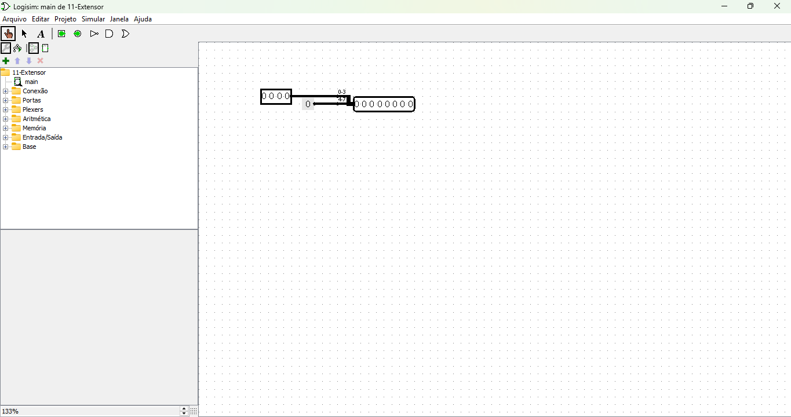

# Extensor de Bits no Logisim

O circuito representado na imagem é um **extensor de bits**, usado em circuitos digitais para ajustar o tamanho de um barramento (conjunto de bits) de entrada para corresponder ao tamanho de um barramento de saída.

[Link do circuito](./11-Extensor.circ)

---

## Estrutura Geral

1. **Entrada**:
   - Um barramento de 4 bits é mostrado na parte esquerda do circuito. Este barramento representa a entrada para o extensor de bits.

2. **Extensão**:
   - O extensor aumenta a quantidade de bits de entrada (de 4 bits para 8 bits neste exemplo). O processo pode ocorrer de duas formas:
     - **Sign Extension (Extensão de Sinal)**: O bit mais significativo (MSB) do número original é replicado nos novos bits para preservar o sinal (positivo/negativo).
     - **Zero Extension (Extensão por Zero)**: Os novos bits adicionados são todos configurados como `0`.

3. **Saída**:
   - Um barramento de 8 bits, localizado à direita, é o resultado da operação de extensão.

---

## Funcionamento no Logisim

- **Conexões**:
  - A entrada de 4 bits está conectada ao extensor de bits por meio de fios digitais.
  - O extensor está configurado para gerar 8 bits na saída, conectados ao barramento de saída.

- **Etiquetas**:
  - O intervalo `0-3` mostrado no fio indica quais bits do barramento de entrada estão sendo conectados à parte correspondente do barramento de saída.

---

## Uso Prático

Extensores de bits são fundamentais em situações como:

- **Operações Aritméticas**:
  - Garantir que os operandos tenham o mesmo tamanho antes de realizar somas ou subtrações.
- **Interface entre Módulos**:
  - Permitir que módulos de hardware com diferentes larguras de barramento interajam.
- **Processadores**:
  - No pipeline de instruções, especialmente para lidar com deslocamento de bits ou sinais de imediato.

---

## Possíveis Melhorias no Circuito

1. **Especificação do Tipo de Extensão**:
   - Indicar explicitamente se o extensor realiza **sign extension** ou **zero extension**.

2. **Adição de Componentes de Controle**:
   - Usar multiplexadores ou flip-flops para configurar dinamicamente o tipo de extensão.

3. **Simulação no Logisim**:
   - Testar o circuito com entradas variáveis para verificar se a saída está sendo estendida corretamente.

---

## Exemplo Prático

Se a entrada de 4 bits for `1010` (em binário):
- **Sign Extension**: A saída será `11111010` (preservando o sinal negativo).
- **Zero Extension**: A saída será `00001010` (adicionando zeros à frente).

---

Esse circuito é fundamental para entender como dados são manipulados em sistemas digitais, especialmente em arquiteturas de processadores.
