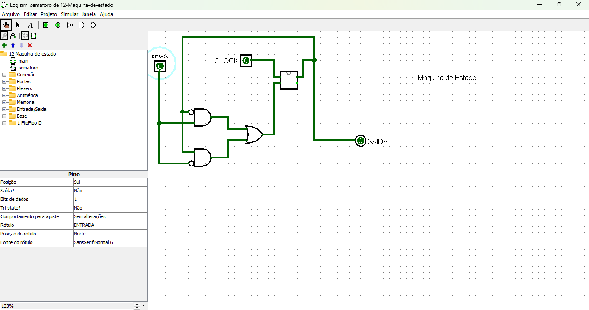

# Máquina de Estado

O circuito é um modelo matemático usado para representar e controlar sistemas que podem estar em um número finito de estados distintos. A transição entre esses estados ocorre com base em entradas e/ou eventos externos. Este modelo é amplamente utilizado em sistemas digitais, controle automático, programação, e outros domínios.

[Link do circuito](./12-Maquina-de-estado.circ)

---

## Componentes do Circuito

1. **Entrada (ENTRADA)**:
   - Representa o sinal externo que influencia o comportamento da máquina de estado.
   - Pode assumir valores binários (**0** ou **1**) para condicionar a lógica do circuito.

2. **Clock (CLOCK)**:
   - O sinal de clock é responsável por sincronizar as transições de estado no Flip-Flop D.
   - As mudanças de estado ocorrem apenas nas bordas do sinal de clock, garantindo um comportamento síncrono.

3. **Flip-Flop D**:
   - Um elemento de memória que armazena o estado atual da máquina.
   - A entrada do Flip-Flop (D) recebe o próximo estado calculado pela lógica combinacional.
   - A saída do Flip-Flop fornece o estado atual para uso na lógica combinacional.

4. **Lógica Combinacional**:
   - Composta por portas **AND**, **OR**, e **NOT**, a lógica combinacional:
     - Calcula o próximo estado a partir da entrada e do estado atual.
     - Determina a saída do circuito com base no estado atual e/ou na entrada.

5. **Saída (SAÍDA)**:
   - Representa o resultado da máquina de estado, que pode ser usado para ativar ou controlar outros sistemas.

---

## Funcionamento do Circuito

1. **Estado Atual**:
   - O Flip-Flop D mantém o estado atual da máquina, que é atualizado em cada ciclo de clock.

2. **Cálculo do Próximo Estado**:
   - A lógica combinacional processa o estado atual e a entrada para determinar o próximo estado.
   - Este próximo estado é alimentado na entrada **D** do Flip-Flop.

3. **Saída do Circuito**:
   - A saída do circuito é gerada pela lógica combinacional.
   - Dependendo da configuração, a saída pode depender apenas do estado atual (**FSM de Moore**) ou do estado atual e da entrada (**FSM de Mealy**).

---

## Aplicações Possíveis

Este circuito simples de máquina de estado pode ser usado em diversas aplicações, como:

1. **Controle de Semáforo**:
   - Cada estado pode representar uma luz do semáforo (vermelho, amarelo, verde), com transições condicionadas pela entrada.

2. **Contadores Sequenciais**:
   - Pode ser configurado para contar ou sequenciar estados de forma síncrona.

3. **Sistemas de Controle**:
   - Útil para implementar sistemas de controle baseados em condições específicas, como máquinas industriais ou sistemas de automação.

---

## Resumo

Este circuito apresenta os elementos fundamentais de uma máquina de estado:
- **Memória (Flip-Flop D)** para armazenar o estado atual.
- **Lógica combinacional** para calcular o próximo estado e a saída.
- **Sinal de clock** para sincronizar as transições de estado.