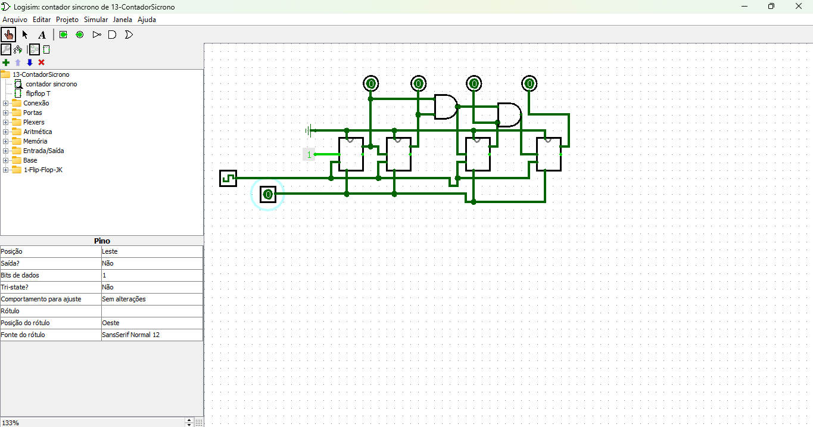

# Contador Síncrono no Logisim

O circuito **contador síncrono**, projetado para contar pulsos de clock de maneira sincronizada. Este tipo de circuito é amplamente utilizado em sistemas digitais para rastrear eventos, medir intervalos de tempo ou implementar máquinas de estado finito.

[Link do contador](./13-ContadorSicrono.circ)

---

## Estrutura do Circuito

### Componentes Principais

1. **Flip-Flops T**:
   - Cada flip-flop representa um bit do contador. Neste circuito, há quatro flip-flops, formando um contador de 4 bits.
   - Os flip-flops são configurados para alternar seus estados na borda do clock (sincronizados).

2. **Portas Lógicas**:
   - Portas AND e outras combinacionais são usadas para determinar quando cada flip-flop deve alternar, baseado nos estados anteriores.

3. **Clock**:
   - O sinal de clock é aplicado simultaneamente a todos os flip-flops, garantindo a operação síncrona.

4. **Entrada e Saída**:
   - O circuito possui uma entrada de clock e quatro saídas correspondendo ao estado do contador.

---

## Funcionamento

### Operação Básica

1. **Entrada do Clock**:
   - A cada pulso do clock, os flip-flops podem mudar de estado dependendo de suas entradas e do estado atual.

2. **Contagem Síncrona**:
   - Todos os flip-flops recebem o pulso de clock ao mesmo tempo.
   - A lógica combinacional das portas determina quando cada flip-flop deve alternar, criando uma sequência binária crescente (ou decrescente, dependendo da configuração).

### Sequência de Contagem

- O contador gera a seguinte sequência de  estados (em binário):

0000 → 0001 → 0010 → 0011 → 0100 → 0101 → 0110 → 0111 → ...

- A contagem continua até o estado máximo (1111 em binário) e reinicia.

---

## Características do Contador Síncrono

1. **Síncrono**:
 - Todos os flip-flops mudam simultaneamente, minimizando atrasos de propagação.

2. **Escalabilidade**:
 - É possível aumentar o número de bits do contador adicionando mais flip-flops e ajustando a lógica combinacional.

3. **Versatilidade**:
 - O contador pode ser configurado para:
   - Contar para frente (incremental).
   - Contar para trás (decremental).
   - Contar em diferentes passos (por exemplo, 2 em 2).

---

## Detalhes do Circuito

- **Flip-Flops T**:
- O flip-flop T alterna seu estado toda vez que recebe um pulso, facilitando a implementação de contadores.

- **Portas Lógicas**:
- As portas AND são usadas para criar as condições de alternância. Por exemplo:
  - O segundo flip-flop (Q1) alterna apenas quando o primeiro flip-flop (Q0) está em `1`.
  - O terceiro flip-flop (Q2) alterna apenas quando os dois primeiros estão em `1`.

- **Reset (Zeragem)**:
- Um pino de reset pode ser adicionado para reiniciar a contagem para `0000`.

---

## Aplicações

- **Temporizadores e Relógios**:
- Contadores são usados para medir tempo e implementar circuitos de relógios.

- **Divisores de Frequência**:
- Reduzem a frequência do sinal de clock para criar sinais mais lentos.

- **Máquinas de Estado**:
- Implementam circuitos que passam por uma sequência de estados predeterminados.

---

## Possíveis Melhorias

1. **Adição de Reset**:
 - Um botão de reset pode ser implementado para reiniciar a contagem.

2. **Display de Saída**:
 - Conectar LEDs ou um display para visualizar os estados do contador em tempo real.

3. **Configuração de Modo**:
 - Adicionar uma entrada para alternar entre contagem ascendente e descendente.

---

Este contador síncrono demonstra os fundamentos da operação sincronizada em circuitos digitais, sendo um exemplo essencial de aplicações práticas em eletrônica.

