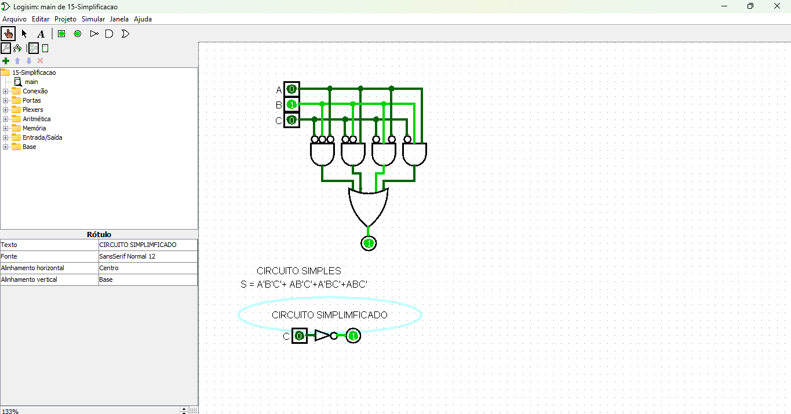

# Explicação dos Circuitos com Mapa de Karnaugh

O objetivo deste documento é explicar como os dois circuitos apresentados possuem a mesma saída, utilizando o **Mapa de Karnaugh** para simplificar a expressão booleana do circuito complexo e validá-la com o circuito simplificado.

[Link do circuito](./15-Simplificacao.circ)

---

## Circuito Original (Não Simplificado)

A expressão booleana do circuito original é:

\[
S = A'B'C + ABC' + A'BC' + ABC
\]

---

## Montagem do Mapa de Karnaugh

Para três variáveis (A, B, C), o Mapa de Karnaugh possui 8 células, representando todas as combinações possíveis dessas variáveis. A seguir, vamos preencher o mapa para a expressão dada.

### Passo 1: Listar os termos

- **A'B'C**: Quando \( A = 0, B = 0, C = 1 \).
- **ABC'**: Quando \( A = 1, B = 1, C = 0 \).
- **A'BC'**: Quando \( A = 0, B = 1, C = 0 \).
- **ABC**: Quando \( A = 1, B = 1, C = 1 \).

### Passo 2: Preencher o mapa

| AB \ C | 0   | 1   |
|--------|------|------|
| 00     | 0    | 1    |
| 01     | 1    | 0    |
| 11     | 1    | 1    |
| 10     | 0    | 0    |

---

## Simplificação com o Mapa de Karnaugh

### Agrupamento

1. O grupo **\( C = 1 \)** cobre as células \((A'B'C, ABC)\), simplificando para \( B \cdot C \).
2. O grupo **\( C = 0 \)** cobre as células \((A'BC', ABC')\), simplificando para \( B \cdot A' + A \cdot B = B \).

### Expressão Simplificada

A expressão booleana simplificada é:

\[
S = B
\]

---

## Comparação dos Circuitos

### Circuito Não Simplificado

- Implementa a expressão completa: \( S = A'B'C + ABC' + A'BC' + ABC \).
- Mais portas lógicas são usadas.

### Circuito Simplificado

- Implementa a expressão simplificada: \( S = B \).
- Apenas a variável \( B \) determina a saída.

### Saída

Ambos os circuitos geram exatamente a mesma saída, como demonstrado pela simplificação da expressão no Mapa de Karnaugh.

---

## Conclusão

A simplificação usando o Mapa de Karnaugh reduz o número de componentes necessários, tornando o circuito mais eficiente sem alterar seu comportamento funcional.
